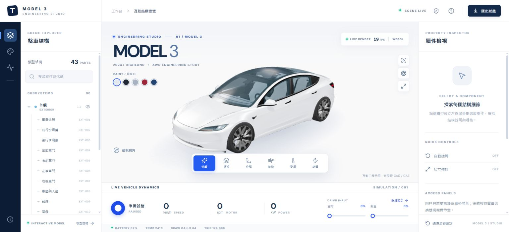
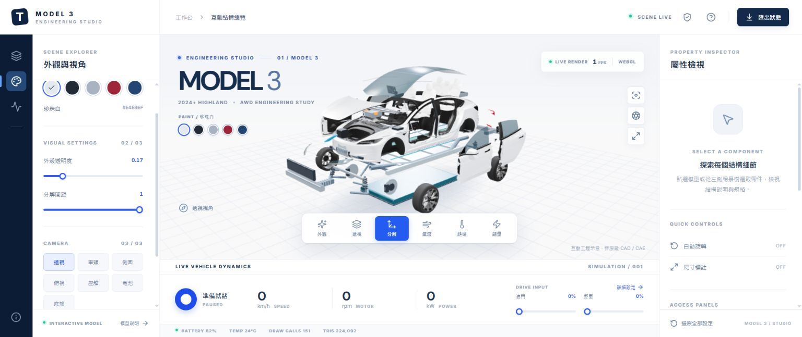
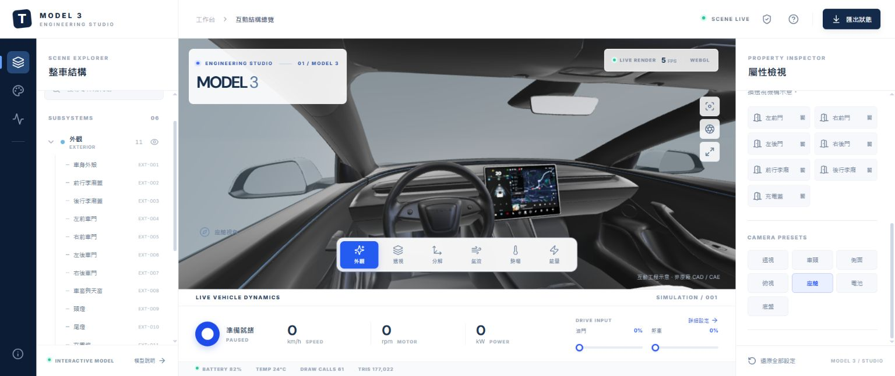
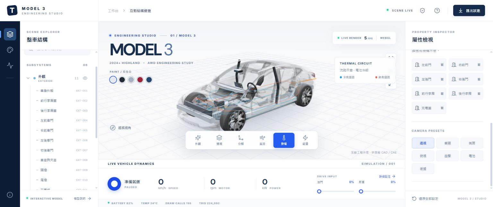

# MODEL 3 · Engineering Studio

Tesla Model 3 六大系統的瀏覽器互動工作台。使用 React、TypeScript、Three.js / WebGL 2；以 [Tesla 台灣官網](https://www.tesla.com/zh_tw/model3)為外觀參考，結合本機 Highland 精細網格與程序化工程結構，無需外部 3D 資產服務。

**授權分開適用：程式碼採 [MIT](LICENSE)；實際 Highland 3D 模型及其內嵌貼圖採 [CC BY 4.0](public/models/highland/LICENSE-CC-BY-4.0.txt)，不屬於 MIT 授權範圍。**

## 實際畫面

以下是直接操作 [GitHub Pages 線上系統](https://e96031413.github.io/TESLA-Model3/) 所拍攝的瀏覽器截圖，並非概念圖或 AI 生成圖片。拍攝版本與操作紀錄見 [截圖說明](docs/screenshots/README.md)。

### 外觀展示與工程工作台



<details>
<summary>查看更多實際畫面：爆炸圖、左駕座艙與熱流</summary>

### 整車分層爆炸圖



### 左駕座艙視角



### 熱管理流路示意



</details>

截圖中的 3D 模型為 **RBLXSupercars** 創作、**brandonleong28** 分享的「2024 Tesla Model 3」，採 **CC BY 4.0**；已為本專案調整分組、比例、材質與互動。[模型署名、來源及修改紀錄](public/models/highland/CREDITS.md)。畫面中的數值為當下示意狀態，不是原廠規格或效能保證。

## 啟動

```sh
npm install
npm run dev
```

開啟 http://127.0.0.1:5173。正式建置：`npm run build`；預覽：`npm run preview`；物理測試：`npm test`。

## 線上版本與部署

- 公開原始碼：[e96031413/TESLA-Model3](https://github.com/e96031413/TESLA-Model3)
- 線上預覽：[GitHub Pages](https://e96031413.github.io/TESLA-Model3/)

推送到 `main` 後，GitHub Actions 會使用 Node.js 24 與 `npm ci` 安裝鎖定版本，執行測試及模型完整性檢查，再建置並部署到 GitHub Pages。儲存庫的 Pages 來源使用 **GitHub Actions**。

本機驗證相同部署路徑：`npm run build -- --base=/TESLA-Model3/`，再執行 `npm run preview` 並開啟 `/TESLA-Model3/`。模型及授權連結隨 Vite 的 base 路徑調整。

## 操作

- 拖曳旋轉，滾輪／雙指縮放，點選零件或搜尋場景樹。
- 下方切換外觀、透視、分解、氣流、熱流、能量六種展示。
- 左側圖示切換場景、車漆／透明度／分解間距及動態控制。
- 右側查看材料與功能、單獨顯示部件、開關四門／前後艙蓋／充電蓋及切換視角。
- 啟動模擬後調整油門與煞車，查看速度、馬達轉速、功率、電量與回充。
- 可下載畫面 PNG 與當前狀態 JSON。快捷鍵：`1` 外觀、`2` 透視、`3` 分解、`Space` 播放、`R` 還原、`Esc` 取消選取。

## 工程範圍

此交付是可執行的 3D 工程展示原型。Highland 外觀採 RBLXSupercars 的 CC BY 4.0 授權模型，保留 179,692 個原始面片與貼圖，並依完整連通元件拆分車門、前艙蓋、輪胎及座艙。車內保留左駕方向盤及儀表台的原始曲面；後艙蓋及充電蓋在原始模型中未獨立分件，因此開啟時使用透視機構示意。[完整作者、來源與修改紀錄](public/models/highland/CREDITS.md)。

公開車身外廓尺寸用於比例參考，內部工程幾何、材料配置、電池容量、動力曲線及流體路徑是明確標示的示意／假設；沒有原廠 CAD/BOM、毫米公差驗證、碰撞計算、CFD 或車輛試驗校準。

即時 FPS、三角面與 draw calls 由瀏覽器測量，依 GPU、解析度與展示狀態不同；60 FPS 是效能目標，不是跨裝置保證。PBR 使用程序化攝影棚環境反射與陰影，並非光線追蹤。

詳見 [工程資料、來源與後續升級範圍](docs/ENGINEERING.md)。

## 程式結構

| 檔案 | 責任 |
| --- | --- |
| `src/App.tsx`、`src/styles.css` | 工作台、操作與資訊卡 |
| `src/VehicleScene.tsx` | 渲染、攝影機、選取、流體路徑與生命週期 |
| `src/vehicle.ts` | 六大系統程序化幾何、部件拆解與機構動畫 |
| `src/highland.ts` | Highland 精細外觀載入、車身分件與動畫 |
| `src/catalog.ts` | 雙語零件目錄、材料、參數及資料性質 |
| `src/physics.ts` | 簡化縱向動力學、回充、SOC 與 Ackermann 轉向 |
| `src/types.ts` | 共享場景狀態與資料介面 |

模型與 UI 透過穩定零件 ID 連結；後續可將程序幾何替換為有授權的 glTF/CAD 轉換資產，保留操作、目錄及狀態架構。

Three.js / WebGL 2 適合直接部署本機或靜態主機的細粒度零件互動；WebGPU 可作後续粒子運算升級。相關限制與 API 以 [Three.js WebGLRenderer 文件](https://threejs.org/docs/pages/WebGLRenderer.html)及 [WebGPURenderer 說明](https://threejs.org/manual/pages/webgpurenderer)為準。

## LICENSE 與第三方模型

| 內容 | 授權與適用範圍 |
| --- | --- |
| 本專案原創程式碼與文件 | [MIT License](LICENSE)，Copyright © 2026 e96031413 |
| 實際下載的模型 `source.glb` | **[CC BY 4.0](public/models/highland/LICENSE-CC-BY-4.0.txt)**，作者為 [RBLXSupercars](https://sketchfab.com/RBLXSupercars)，並保留分享者 [brandonleong28](https://sketchfab.com/3d-models/tesla-model-3-2024-36c52f3f89f6439c90310f14e8ff33f2) 的署名 |
| 適配後模型 `highland.glb` 及兩個 GLB 中的內嵌貼圖 | 同樣保留 **CC BY 4.0**；修改模型不會使其變成 MIT 授權 |
| README／文件截圖中的模型內容 | 保留模型的 CC BY 4.0 署名與來源；參見 [截圖授權說明](docs/screenshots/README.md) |
| 第三方套件與字型 | 各自遵循原始授權，不因專案使用 MIT 而改變 |

分享或修改模型時，請保留作者與分享者署名、CC BY 4.0 授權連結及修改說明。完整資訊見 [THIRD_PARTY_NOTICES.md](THIRD_PARTY_NOTICES.md) 與 [模型 CREDITS.md](public/models/highland/CREDITS.md)。模型原始網址、取得來源的固定版本與 SHA-256 均記錄於 CREDITS。

本專案與模型均不代表 Tesla 官方產品或背書，MIT 與 CC BY 4.0 不授予 Tesla 商標使用權。
